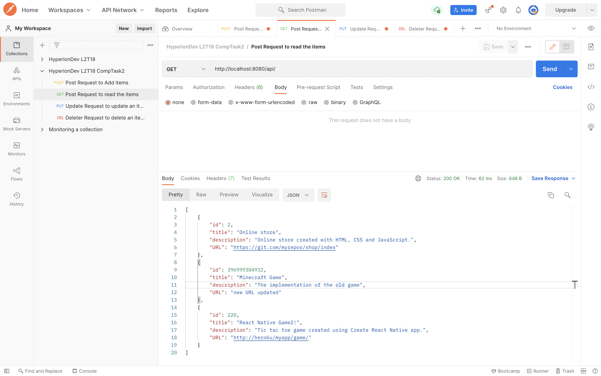
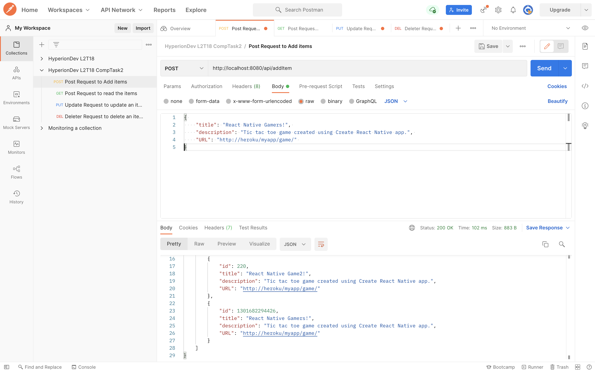
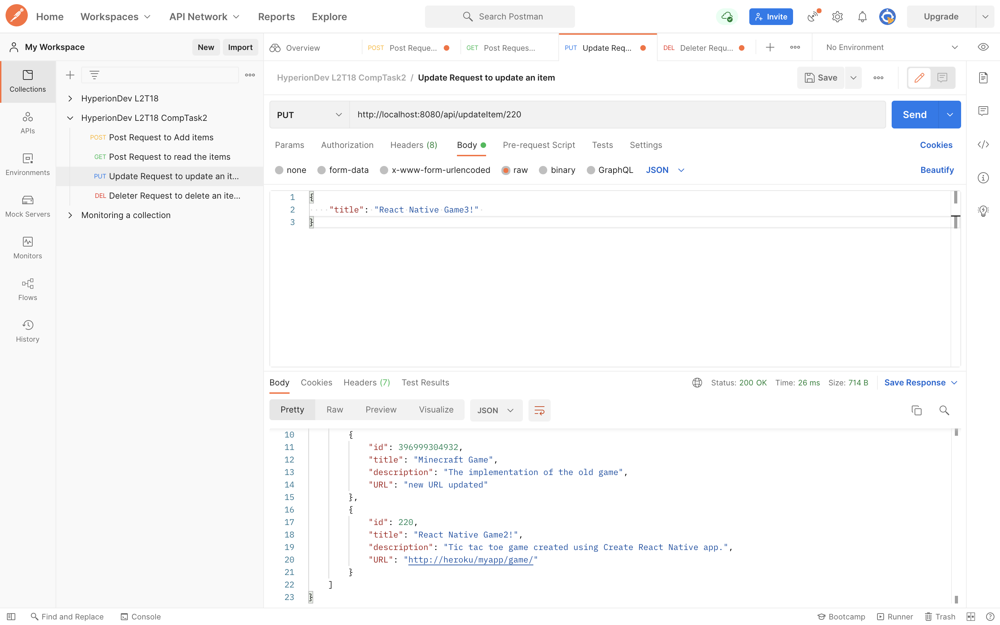
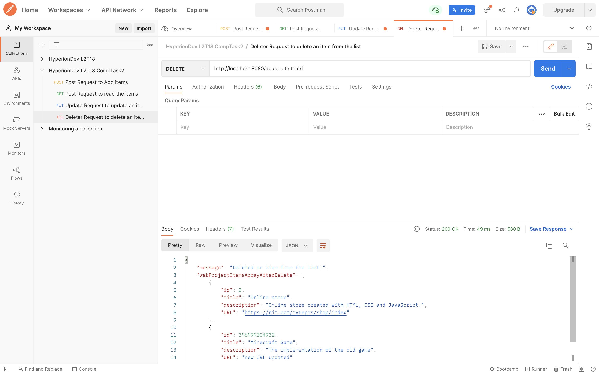

# Web Projects Items

This RESTful API is created with Express.js, a popular Node.js library that simplifies the development of api with JavaScript.

In order to test this application, the user needs to download the files on their local environment in a folder. Change Directory into this repository in the command line and run **`npm install`** to install the dependencies, then run **`npm start`** to start the api server on port 8080.

Then you would need to have Postman installed on your machine to test the api routes. Open Postman and follow the detailed instructions below on how to test the API.

To download Postman go to [postman.com](https://www.postman.com/)

## How to Test the API routes using Postman

1. Testing GET requests
2. Testing POST requests
3. Testing PUT requests
4. Testing DELETE requests

Below are the details that the user can follow to test each of the CRUD operations (Create, Read, Update & Delete)

### 1. Testing GET Requests

Open the Postman application and click on the + icon to make a new request. On the top of the testing view, ensure you select GET on the drop right menu and then enter the local host address http://localhost:8080/api/.

Once done just click the **Send** button to make GET request.

You should see the list of items in an array similar to the image below

### 2. Testing POST Requests

Follow the initial steps as above in the Testing of GET requests. Instead of selecting GET in the dropdown menu, you now selecct POST.

Then you also need to update the address to be http://localhost:8080/api/addItem. The select the _**Body**_ menu to enter the details of your item in a JavaScript Object format. Enter the `title`, `description` and `URL`. You do not need to enter the `id` as this one would be uniquely and automatically generated for you.

Once done just click the **Send** button to make POST request.

### 3. Testing PUT Requests

Now at this stage you should be pretty much familiar with the initial steps of making a request on Postman. Ensure you select the PUT option in the dropdown menu and update the address to be http://localhost:8080/api/updateItem/:id whereby the `:id` is a placeholder for the id of the item that you wish to update.

Then in a similar manner that you have used to make POST requests, you can then enter the property names and values in a JavaScript Object syntax to update these values. You do not need to enter all the properties, just the ones that you want to update. The algorithm in the code will know which ones are not changing and will keep these property name and values.

Hence once done you finalize with the famous **Send** button to make PUT request.

### 4. Testing DELETE Requests

Now to the final request to be tested. A less daunting one but one that needs care as it is a potentially destructive action, the DELETE request to delete an item!

This is significantly similar to the PUT request process above with one less step; you don't need to enter the body of request as you would be deleting the entire item. Be sure to enter the correct ID of the item that you wish to delete in place of `:id` in this updated address http://localhost:8080/api/deleteItem/:id

> Happy Testing!
